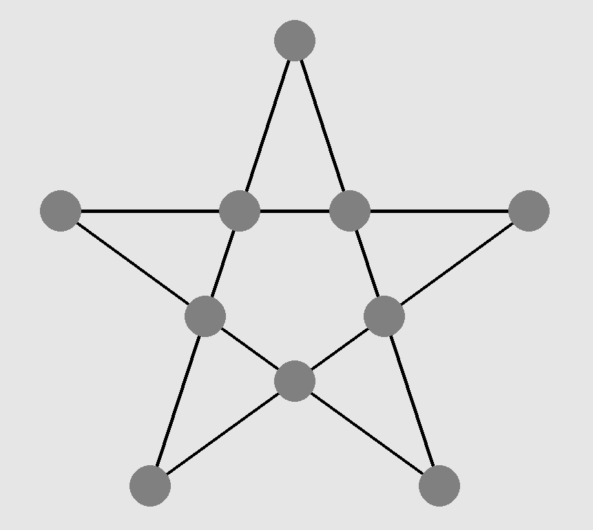

# The Kaooa Game
# Creator - Dx
I have built a simple &amp; traditional `Indian style 2-player board game` using PyGame library.
There are some basic rules that I have mentioned as below so please do check them in order to enjoy the game to its best

Hope you enjoy playing it!

## Assumptions

* Python is installed and setup on the system 

* Both players try to win their games to their best level in order to have a fair match

## Setup Procedure
* There are a couple of libraries that are supposed to be installed onto your system in order to be able to properly play the game :
    * `pygame` library
    * `sys` library\
Please keep thse installed in order to have a smooth experience with the game

* Please keep the file `kaooa_functions.py` in the same directory as the main file `kaooa.py`

* Once these libraries are installed, you just need to open your terminal and run the python script for the game program

* > python3 kaooa.py

* Once that is done, you will be asked to enter player names for both the sides `ie. Kaooa` &amp; `Baaz` in the `terminal itself`

* After that is done, press `Enter` and switch to the new `pygame GUI` window that must have opened

* In this window, start playing the game by just simple `mouse clicks` and follow the game as the prompts keep updating about the game stats

## Rules of the Game
* There are total `7 Kaooas (Crows)` &amp; `1 Baaz (Eagle)` 

* It is a 2 player game where one of the player plays as `Kaooas` & the other one as `Baaz`. Both of them try to win as individuals & play their permissible moves alternately

* First move is made by the `Kaooas`

* The game is played on a `Star shaped` board with $10$ cells in total to place our avatars `ie. Kaooas` &amp; `Baaz`. An exemplar look of a blank board is as shown below

### `MOVEMENT of KAOOAS` :
>   * can only start moving after 7 of them have been placed atleast once on the board
>   * does not matter if all of them are not present on the board at a time
>   * until then, the only move that a `Kaooa` player can perform is to place one of its avatars at an empty cell on the board
>   * Kaooas can move only 1 space at a time once they are allowed to start moving across the board
>   * Kaooas can not move to a neighbouring place if there is already either another `Kaooa` or `Baaz`

### `MOVEMENT of BAAZ` :
>   * can only start moving after the only `Baaz` is placed on the baord
>   * once the `Baaz` is placed, it can move in 2 different ways :
>       * moving to the `adjacent` empty cell on the board
>       * in case there is a `Kaooa` in the neighbouring cell and there exists an `empty` cell in straight line on that path after the `Kaooa`, then the `Baaz`  can move to that cell and kill the `Kaooa` in the middle by removing it off the board and making that empty again

### `WIN for KAOOA`
>>`Kaooa` wins when the game when the `Baaz` is eventually put in such a cell that there is `NO PERMISSIBLE MOVE` left for the `Baaz` to make\
>>This has to be done by the `Kaooas` before the `Baaz` kills 4 of them

### `WIN for BAAZ`
>>`Baaz` wins the game when it gets successful in `KILLING 4 KAOOAS` by using the permissible move for killing a `Kaooa` as mentioned above in the rules\
>>This has to be done before getting completely blocked out of moves by the `Kaooas`

## Conclusion
That was all that was for a pre-setup stage in order to play the game. It is a simply Python script and only requires a couple of libraries to be installed before running the script.

Hope it works well on your system! 
In case it does not, I am completely open to all kind of `suggestions & issues` so please feel free to share them with me!

# HAPPY GAMING FOLKS !!!
